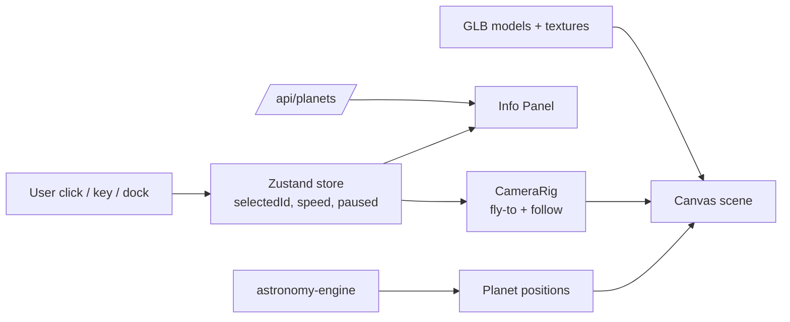

<!-- ============================================================
  Replace YOUR_USERNAME, YOUR_REPO and YOUR-APP.vercel.app below.
  Put the animated orbit file at ./docs/orbit.svg
  Optional: add ./docs/demo.gif (screen recording of the zoom feature)
============================================================= -->

<div align="center">


<a href="https://github.com/YOUR_USERNAME/YOUR_REPO">
  
</a>

<br/>



<br/><br/>

[](https://YOUR-APP.vercel.app)
[](https://nextjs.org)
[](https://react.dev)
[](https://threejs.org)
[](https://vercel.com)


**[✨ Features](#-features) · [🎮 Controls](#-controls) · [🚀 Getting Started](#-getting-started) · [🪐 Models](#-3d-models--textures) · [📡 APIs](#-apis) · [☁️ Deploy](#️-deploy-free-on-vercel)**

</div>

---

## 🌌 About

**Solar System 3D** is an interactive 3D solar system that runs in the browser. Click any planet (or the Sun and the Moon) and the camera flies to it, follows it along its orbit, and lets you zoom in close on its model while an info panel shows its facts.

Everything is built with free and open-source tools and deploys for free.

<!-- Uncomment after adding your recording
<div align="center">
  
</div>
-->

---

## ✨ Features

| | Feature | Details |
|---|---|---|
| ☀️ | **Full solar system** | Sun and 8 planets with their own size, orbit and rotation speed |
| 🌙 | **Moon with its own model** | Orbits Earth, tidally locked, and fully selectable |
| 🎯 | **Focus and zoom on every body** | Click a body or use the focus dock, and the camera flies there and follows it |
| 🔍 | **Close-up zoom** | Zoom to the surface of any model without going inside it |
| 🛰️ | **Real 3D models (GLB)** | Planets, Moon and optional spacecraft such as the ISS |
| 📡 | **Live planet positions** | Real positions for any date, with a "Now" button |
| 📖 | **Info panel** | Diameter, distance, orbital period, moons and a fun fact |
| ⏱️ | **Time controls** | Speed slider, pause and play |
| 📱 | **Mobile friendly** | Touch drag to rotate, pinch to zoom |
| 🛡️ | **Safe fallbacks** | A missing model or texture falls back to a colored sphere, so the app never crashes |

---

## 🎮 Controls

| Action | Desktop | Mobile |
|---|---|---|
| Rotate | Left mouse drag | One finger drag |
| Zoom | Scroll wheel or `+` / `-` | Pinch |
| Focus a body | Click it, or use the focus dock | Tap it, or use the focus dock |
| Jump to a body | `0`–`9` | Focus dock |
| Previous / next body | `←` / `→` | Swipe the dock |
| Back to overview | `Esc` or click empty space | Tap **Overview** |

---

## 🚀 Getting Started

### Prerequisites

- Node.js 18.18 or newer
- npm, yarn, pnpm or bun

### Install and run

```bash
# 1. Clone
git clone https://github.com/YOUR_USERNAME/YOUR_REPO.git
cd YOUR_REPO

# 2. Install
npm install

# 3. Start the dev server
npm run dev
```

Open [http://localhost:3000](http://localhost:3000) and start exploring.

### Environment variables

Create a `.env.local` file in the project root:

```env
# Optional. Get a free key at https://api.nasa.gov (DEMO_KEY is used if missing)
NASA_API_KEY=your_key_here
```

---

## 🪐 3D Models & Textures

Models are **not downloaded automatically**. Add them yourself, and use lowercase file names exactly as listed (Vercel is case-sensitive).

<details>
<summary><b>📦 Click to see the model checklist</b></summary>

<br/>

Place files in `public/models/`:

| File | Body | Required |
|---|---|---|
| `sun.glb` | Sun | Optional |
| `mercury.glb` | Mercury | Optional |
| `venus.glb` | Venus | Optional |
| `earth.glb` | Earth | Optional |
| `moon.glb` | Moon | Optional |
| `mars.glb` | Mars | Optional |
| `jupiter.glb` | Jupiter | Optional |
| `saturn.glb` | Saturn | Optional |
| `uranus.glb` | Uranus | Optional |
| `neptune.glb` | Neptune | Optional |
| `iss.glb`, `perseverance.glb`, `juno.glb` | Extras | Optional |

If a file is missing, that body is drawn as a textured or colored sphere instead.

</details>

<details>
<summary><b>🖼️ Click to see the texture checklist</b></summary>

<br/>

Place 2K `.jpg` or `.webp` files in `public/textures/`:

`sun`, `mercury`, `venus`, `earth`, `moon`, `mars`, `jupiter`, `saturn`, `saturn_ring`, `uranus`, `neptune`

Free sources:
- [Solar System Scope textures](https://www.solarsystemscope.com/textures/)
- [NASA 3D Resources](https://science.nasa.gov/3d-resources/)

</details>

<details>
<summary><b>⚡ Click for performance tips</b></summary>

<br/>

- Keep each GLB under about 5 MB. Compress with [gltf.report](https://gltf.report) or `gltf-transform`.
- Use 2K textures at most.
- Detailed models only load for the focused body.

</details>

---

## 📡 APIs

All free.

| Purpose | Source |
|---|---|
| Live planet positions | [`astronomy-engine`](https://github.com/cosinekitty/astronomy) (runs in the browser, no key) |
| Planet facts | [Solar System OpenData](https://api.le-systeme-solaire.net) |
| Picture of the day | [NASA Open APIs](https://api.nasa.gov) |
| 3D models | [NASA 3D Resources](https://science.nasa.gov/3d-resources/) |

---

## 🧱 Architecture



---

## 📁 Project Structure

```text
├── app/
│   ├── api/
│   │   ├── planets/route.js     # planet facts (cached)
│   │   └── apod/route.js        # NASA picture of the day
│   ├── layout.js
│   └── page.js                  # dynamic import, ssr: false
├── components/
│   ├── SolarSystem.jsx          # Canvas + scene
│   ├── Planet.jsx
│   ├── PlanetModel.jsx          # GLB loader with fallback
│   ├── CameraRig.jsx            # fly-to and follow logic
│   ├── FocusDock.jsx            # focus button for every body
│   ├── InfoPanel.jsx
│   └── Controls.jsx
├── data/
│   ├── bodies.js
│   └── models.js
├── lib/
│   └── ephemeris.js
├── store/
│   └── useSolarStore.js
├── public/
│   ├── models/                  # your .glb files
│   └── textures/                # your .jpg / .webp files
└── docs/
    └── orbit.svg
```

---

## ☁️ Deploy Free on Vercel

1. Push the project to GitHub.
2. Go to [vercel.com/new](https://vercel.com/new) and import the repository.
3. Add `NASA_API_KEY` under **Settings → Environment Variables** (optional).
4. Click **Deploy**.

[](https://vercel.com/new/clone?repository-url=https://github.com/YOUR_USERNAME/YOUR_REPO)

---

## 🗺️ Roadmap

- [x] Sun, 8 planets and orbit rings
- [x] Click to focus and zoom on every body
- [x] Moon with its own GLB
- [x] Live planet positions
- [ ] Asteroid belt
- [ ] Planet search
- [ ] Ambient sound
- [ ] VR mode

---

## 🙏 Credits

- 3D models: [NASA 3D Resources](https://science.nasa.gov/3d-resources/) and any other creators credited in the in-app info panel
- Textures: [Solar System Scope](https://www.solarsystemscope.com/textures/)
- Built with [Next.js](https://nextjs.org), [React Three Fiber](https://r3f.docs.pmnd.rs), [drei](https://github.com/pmndrs/drei) and [Three.js](https://threejs.org)

Check each model's and texture's license before publishing.

---

<div align="center">

If you like this project, give it a ⭐


</div>